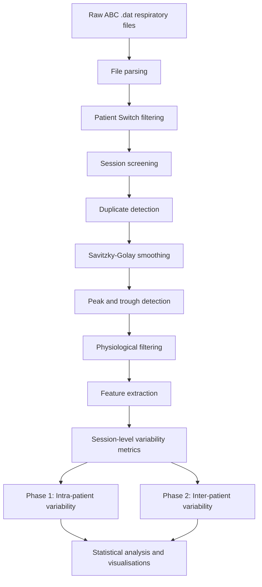

# Computational Framework for Respiratory Variability Analysis in ABC-Guided Radiotherapy

[](https://python.org)
[](https://github.com/RuthveekMR/abc-respiratory-variability-analysis)

---

## Overview

This repository contains the complete computational analysis pipeline accompanying the pilot manuscript:

# Characterisation of Respiratory Breathing Variability in Patients Undergoing Radiotherapy Using the Active Breathing Coordinator  
### A Pilot Intra- and Inter-Patient Analysis

Developed within the  
**Department of Data Science & Engineering**  
Manipal Institute of Technology (MIT), MAHE, Manipal, India  

in academic and clinical research collaboration with  

**Kasturba Medical College (KMC), MAHE, Manipal, India**

The pipeline processes spirometric volume-time signals recorded using the Elekta Active Breathing Coordinator (ABC) device during radiotherapy treatment sessions, extracts respiratory cycle features, and quantifies intra- and inter-patient breathing variability using signal processing and non-parametric statistical methods.

> **Important:** This repository represents an exploratory pilot-study computational analysis. All findings are preliminary and should not be interpreted as clinically validated conclusions. The code and analytical outputs are shared to support reproducibility and future research.

---

## Research Motivation

Respiratory motion is a recognised source of geometric uncertainty in thoracic and upper abdominal radiotherapy. The Active Breathing Coordinator (ABC) device attempts to minimise this uncertainty by suspending respiration at predefined lung volumes during treatment delivery.

However, the effectiveness of ABC-guided radiotherapy depends on the reproducibility of a patient’s underlying respiratory behaviour across and within treatment fractions.

This repository provides a reproducible computational framework to:

- characterise session-to-session respiratory variability within individual patients (intra-patient analysis),
- compare respiratory variability patterns across patients (inter-patient analysis),
- and evaluate whether respiratory behaviour demonstrates patient-specific variability characteristics.

---

## Research Objectives

1. Quantify intra-patient respiratory cycle variability using coefficient of variation (CV) metrics for cycle duration and tidal volume amplitude.
2. Evaluate intra-patient breathing consistency using coefficient-of-variation of session-wise CVs (CoV-of-CV).
3. Assess inter-patient respiratory variability differences using non-parametric statistical testing.
4. Explore respiratory rhythm regularity using Poincaré plot descriptors (SD1/SD2).

---

## Methodology Summary

### Signal Acquisition

- Device: Elekta Active Breathing Coordinator (ABC)
- Sampling rate: 50 Hz
- Signal type: Volume-time respiratory waveform (litres)
- Sessions analysed: Treatment fractions only (`TRT`, `Tx`, `tx`, `sbrt`)

---

### Preprocessing Pipeline

1. **File parsing** — locate `HeaderEnd` marker and read semicolon-delimited waveform data
2. **Patient Switch filtering** — retain only rows with `Patient Switch = 1`
3. **Session screening** — minimum 300-second duration and minimum 100 raw respiratory cycles
4. **Duplicate detection** — signal signature comparison to eliminate redundant recordings

---

### Signal Processing

5. **Savitzky-Golay smoothing** — window size 51, polynomial order 3
6. **Peak/trough detection** — `scipy.signal.find_peaks`
7. **Physiological cycle filtering**
   - cycle duration: 2–10 seconds
   - minimum amplitude: 0.05 L

---

### Feature Extraction

- **Cycle duration** — interval between consecutive inspiratory peaks (seconds)
- **Cycle amplitude** — volume difference between inspiratory peak and expiratory trough (litres)

---

### Variability Metrics

| Metric | Description |
|---|---|
| CV_duration | Normalised respiratory rhythm variability |
| CV_amplitude | Normalised tidal volume variability |
| RMSSD_duration | Breath-to-breath rhythm irregularity |
| CoV-of-CV | Session-to-session consistency of variability |

---

## Statistical Analysis

| Test | Purpose |
|---|---|
| Shapiro-Wilk | Assess normality of per-session variability distributions |
| Levene | Evaluate homogeneity of variance across patient groups |
| Kruskal-Wallis | Assess inter-patient respiratory variability differences |
| Mann-Whitney U | Exploratory post-hoc pairwise comparisons |

### Key Statistical Results

| Metric | Statistic |
|---|---|
| CV_duration | H = 20.55, p = 0.0010 |
| CV_amplitude | H = 15.60, p = 0.0081 |

> Non-normality within portions of the cohort and limited pilot-study sample sizes justified the use of non-parametric statistical testing over one-way ANOVA.

---

## Visualisations

| Figure | Description |
|---|---|
| Fig. 1 | Respiratory waveform and breathing cycle detection |
| Fig. 2 | Breath-to-breath respiratory cycle duration timeseries |
| Fig. 3 | Intra-patient CV_duration variability |
| Fig. 4 | Intra-patient CV_amplitude variability |
| Fig. 5 | Inter-patient CV_duration violin distributions |
| Fig. 6 | Inter-patient CV_amplitude violin distributions |
| Fig. 7 | Respiratory variability profile scatter map |
| Fig. 8 | Poincaré plots of respiratory cycle regularity |

An analysis workflow flowchart is additionally included within the accompanying manuscript documentation.

---

## Key Exploratory Findings

> These findings are exploratory pilot-study observations and require validation in larger prospective cohorts.

- **11,651 valid respiratory cycles** extracted across 29 treatment sessions from 6 patients.
- Approximately **7.1% global cycle rejection rate** after physiological filtering.
- Most patients demonstrated relatively reproducible intra-patient respiratory rhythm variability based on exploratory CoV-of-CV analysis.
- Significant inter-patient differences were observed in:
  - respiratory rhythm variability (`CV_duration`)
  - tidal volume amplitude variability (`CV_amplitude`)
- A substantial range of pooled respiratory variability metrics was observed across patients, supporting the presence of patient-specific breathing characteristics.
- Respiratory rhythm variability and tidal volume variability appeared to behave as partially independent dimensions of respiratory behaviour within this cohort.

---

## Repository Structure

```text
abc-respiratory-variability-analysis/
│
├── notebooks/
│   ├── preprocessing/
│   │   ├── patient_preprocessing_P1.ipynb
│   │   ├── patient_preprocessing_P2.ipynb
│   │   ├── patient_preprocessing_P3.ipynb
│   │   ├── patient_preprocessing_P4.ipynb
│   │   ├── patient_preprocessing_P5.ipynb
│   │   └── patient_preprocessing_P6.ipynb
│   │
│   └── RespiratoryVariabilityAnalysis.ipynb
│
├── results/
│   ├── breathing_results.csv
│   └── figures/
│       ├── fig1_waveform_cycles.png
│       ├── fig2_all_sessions_duration_timeseries.png
│       ├── fig3_intra_cv_duration.png
│       ├── fig4_intra_cv_amplitude.png
│       ├── fig5_inter_cv_duration.png
│       ├── fig6_inter_cv_amplitude.png
│       ├── fig7_respiratory_variability_profile.png
│       └── fig8_poincare.png
│
├── paper/
│   └── manuscript.pdf
│
├── requirements.txt
├── .gitignore
└── README.md
```

---

## Data Availability

Raw respiratory waveform `.dat` files are not publicly distributed due to patient privacy considerations and institutional data governance policies.

This repository includes:
- computational analysis pipelines,
- statistical workflows,
- processed summary outputs,
- and visualisation scripts

required to reproduce the analytical methodology presented in the accompanying pilot-study manuscript.

This repository is intended for academic and research purposes only.

---

## Installation

### Prerequisites

- Python 3.9+
- pip
- Jupyter Notebook

---

### Setup

```bash
git clone https://github.com/RuthveekMR/abc-respiratory-variability-analysis.git

cd abc-respiratory-variability-analysis

pip install -r requirements.txt

jupyter notebook
```

---

## Reproducibility Workflow

1. Obtain raw ABC `.dat` files with appropriate ethical and institutional approvals.
2. Store patient files locally (not tracked in git).
3. Update `BASE_PATH` within the analysis notebook.
4. Run preprocessing notebooks within `notebooks/preprocessing/`.
5. Run `RespiratoryVariabilityAnalysis.ipynb`.
6. Regenerate all figures and summary outputs.

All manuscript numerical results are generated programmatically through the analysis pipeline. No values are manually hardcoded.

---

## Analysis Pipeline Diagram



---

## Limitations

- **Small pilot cohort:** Six patients from a single institution; findings should not be generalised clinically.
- **Limited pairwise statistical power:** Although multiple treatment fractions were analysed per patient, the pilot cohort size limits the statistical power of post-hoc pairwise comparisons.
- **No direct motion or dosimetric correlation:** The present study focuses on respiratory variability characterisation and does not directly evaluate tumour-motion trajectories or delivered dosimetric consequences associated with observed breathing patterns.
- **Exploratory thresholding:** The approximate CoV-of-CV threshold used for respiratory consistency assessment is cohort-derived and not clinically validated.
- **Exploratory study design:** Results should be interpreted as hypothesis-generating observations requiring future validation.

---

## Future Work

- Expansion to larger multi-centre patient cohorts.
- Longitudinal respiratory variability analysis across complete radiotherapy treatment courses.
- Integration of respiratory variability metrics with tumour-motion and dosimetric analysis.
- Investigation of whether early-session respiratory variability metrics can predict subsequent breathing stability.
- Investigation of whether patient-specific respiratory variability metrics may support personalised respiratory management and abdominal compression assessment strategies during radiotherapy.

---

## Citation

If you use this repository in academic work, please cite:

```bibtex
@misc{ruthveek2026abc,
  title  = {Characterisation of Respiratory Breathing Variability in Patients
            Undergoing Radiotherapy Using the Active Breathing Coordinator:
            A Pilot Intra- and Inter-Patient Analysis},
  author = {Ruthveek M. R.},
  year   = {2026},
  note   = {Pilot exploratory study manuscript},
  institution = {Department of Data Science and Engineering,
                 Manipal Institute of Technology,
                 MAHE, Manipal, India}
}
```

Repository citation:

```text
Ruthveek M. R. (2026).
abc-respiratory-variability-analysis [Software].
GitHub.
https://github.com/RuthveekMR/abc-respiratory-variability-analysis
```

---

## Acknowledgements

Analysis performed using:
- NumPy
- Pandas
- SciPy
- Matplotlib

Statistical and respiratory variability methodology was informed by prior respiratory physiology and variability-analysis literature.

---

*This repository accompanies a pilot exploratory computational study. All interpretations remain preliminary and subject to the limitations described in the accompanying manuscript.*
